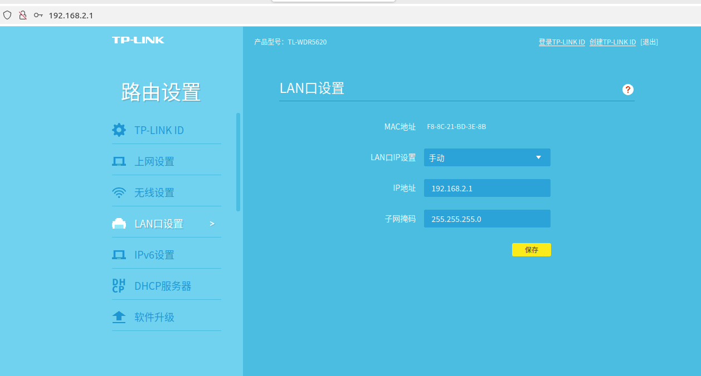

## Installation
forked from `https://github.com/OpenTeleVision/TeleVision`
```
    conda create -n recordtv python=3.8
    conda activate recordtv
    pip install -r requirements.txt
    cd teleop
    pip install -e .
```
前往teleop目录进行key生成，获得本机ip：

`ifconfig`

在teleop目录下用下面代码生成key（把192.168.8.102替换为本机ip）：

`mkcert -install && mkcert -cert-file cert.pem -key-file key.pem 192.168.8.102 localhost 127.0.0.1`  

开放本地的8012端口：

`sudo ufw allow 8012`
## 代码说明
遥操脚本使用说明：
1. teleop_bridge.py，用于相机视频流stream接收与plot（特殊用途）
2. teleop_exoskeleton.py，用与老版本的Dynamixel电机的同构teleop，需要接入同构机械臂再启用，夹爪状态由mediapipe输出，需要指定使用的识别相机（假如插入新的相机，默认使用电脑自带的相机）。
3. teleop_vr.py，用于quest3的ik teleop，quest3负责出ee位置，通过pybullet输出dof_pos，可以指定是否在vr中接入图片
数据录制脚本使用说明：
1. /record/record_dual.py，/record/record_single.pt，接入realsense相机，接收底层反馈的dofpos，用于数据采集，在会把数据保存到/record目录下
2. /record/record2dataset.py，把文件夹中所有的单独数据包做成一个大包。
## Usage
### television：
television的两种使用方法：
假如使用本地无线网进行teleop（这里默认使用一个单独的路由器专门完成此任务）：
1. 接入一个路由器，手动设置lan口（为了不与机械臂控制的交换机冲突，将lan口的ip设置为手动的192.168.x.1），机械臂控制的交换机ip为192.168.1.x，所以需要避开。
2. 手动设置电脑端的ip，这里设置为 `192.168.2.30`，假如设置为别的，请修改/utils/vuer/TeleVision_controller_pybullet.py中对应的ip
3. 把电脑与quest3连入同一个无线网，电脑最好用网线接入
5. 启动 `python teleop_vr.py` 
6. 启动quest，在浏览器访问：[https://192.168.2.30:8012/](https://192.168.2.30:8012/)?ws=wss://[192.168.2.30:8012](http://192.168.2.30:8012)
7. 点击enter vr进入沉浸模式，path through进入透视模式



假如使用端口反向映射进行teleop：
1. 把quest3用usb线连接电脑，在quest3中点击允许电脑访问
2. 用 `adb devices`查看是否正确连接
3. 使用 `adb reverse tcp:8012 tcp:8012`，进行反向映射
4. 修改/utils/vuer/TeleVision_controller_pybullet.py中对应的ip为localhost
5. 启动 `python teleop_vr.py` 
6. 启动quest，在浏览器访问：[https://localhost:8012/](https://192.168.2.30:8012/)?ws=wss://[localhost:8012](http://192.168.2.30:8012)

在teleop_vr.py中可以选择是否接入realsense，指定camera_serial，并且可以选择是否使用真实反馈的arm dof，具体信息请查看代码。
操作说明：
- 使用rightcontroller进行操作，leftcontroller被禁用
- `食指板机`控制夹爪开闭，方块显示绿色则发出的指令为关闭，默认打开方块为蓝色
- `中指板机`用于控制夹爪是否跟随，按下则ik求解当前controller的位置，使用zmq将控制指令发出（只有在按下时才发）
- `按钮A`用于让机械臂返回一个默认位置
- `meta键`长按用于重置位置
### record
直接根据需求运行record_dual.py或者record_single.py，记得修改端口与camera信息（若修改）。
操作说明：
- R键开始录制
- F键停止录制并保存
- T键放弃当前数据
- M键给当前时间帧打点
## ISSUE（已全部解决）
1. 只有一个controller会卡住的问题
2. 头手坐标转换的问题，把urdf的base放到0位，然后直接把controller的xyz给发出去，但是需要人的位置默认在0点
3. 初始位置的问题
4. 有没有办法重置人的坐标
5. 把crpilot和录制全部整合进来
### 交互
- 若没有squeeze，则发送一个固定的初始坐标
- 若squeeze，则发送ik求完的坐标
### 坐标转换
- 获取头与右手的的xyz，ryp
- 用手的xyz减去头的xyz得到手相对于头的xyz坐标
- 最终输出手相对于头的xyz与自己在世界坐标系的ryp